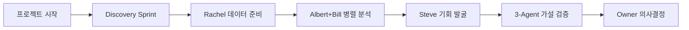

# UMIS v6.2 - ChatGPT 활용 가이드

> **Universal Market Intelligence System v6.2 - Validated Intelligence Edition**  
> 불확실한 상황에서도 적응하며 진화하는 범용 시장 분석 시스템

## 📋 개요

UMIS v6.2는 20-30% 낮은 명확도로도 시장 분석을 시작할 수 있는 적응형 지능 시스템입니다. ChatGPT에서 모듈 파일들을 첨부하여 5명의 AI 에이전트가 협업하는 시장 분석을 수행할 수 있습니다.

### 🆕 v6.2.2의 혁신적 개선사항

1. **지원+검증 시스템**: 자연스러운 일상 지원 + 엄격한 의무 검증
2. **Albert-Steve 검증 균형화**: 둘 다 동등한 3명 의무 검증
3. **Discovery Sprint 적응형 게이트**: 명확도 ≥7 (Fast Track) vs <7 (Full Sprint)  
4. **SECTION 0 신규**: AI 전용 5분 시스템 파악 (상태 기계)
5. **협업 프로토콜 단순화**: 복잡한 프로토콜 → 간단한 원칙

## 🚀 ChatGPT 설정 방법

### 1단계: 커스텀 인스트럭션 설정

```
ChatGPT 설정 > 커스텀 인스트럭션 > 
custom_instructions_v6.2.txt 내용을 복사하여 붙여넣기
```

### 2단계: 첨부 파일 준비

**필수 파일 (모든 프로젝트)**:
- `workflows/adaptive_workflow_v6.2.yaml` - 기본 워크플로우
- `agents/observer_albert_v6.2.yaml` - 시장 구조 관찰
- `agents/explorer_steve_v6.2.yaml` - 기회 발굴

**선택 파일 (필요시 추가)**:
- `agents/quantifier_bill_v6.2.yaml` - SAM 계산 필요시
- `agents/validator_rachel_v6.2.yaml` - 데이터 검증 필요시  
- `agents/guardian_stewart_v6.2.yaml` - 고급 모니터링 필요시

### 3단계: 프로젝트 시작

```
"UMIS v6.2로 시장 분석을 시작하겠습니다"
```

## 🎯 핵심 특징 및 사용법

### 1. 적응형 시작 (Adaptive Start)

**기존 방식의 문제점**: 완벽한 계획을 세우려다 기회 놓침  
**UMIS v6.2 해법**: 20-30% 명확도로도 시작

```
❌ "아직 목표가 불분명해서 나중에..."
✅ "AI 관련 뭔가를 해보고 싶어요" (명확도 25% = OK!)

→ Discovery Sprint 자동 실행으로 함께 목표 구체화
```

### 2. 5-Agent 협업 시스템

**Albert** (관찰자): "시장이 '어떻게' 작동하는가?"
- 돈의 흐름 추적, 거래 패턴 관찰
- 해석 없이 구조적 사실만 보고
- 출력: Market Reality Report

**Steve** (탐험가): "관찰에서 어떤 '기회'를 찾을 수 있는가?"
- 7단계 기회 발굴 프로세스 실행  
- 가설 검증 사이클로 현실성 확보
- 출력: Opportunity Portfolio (Top 5-7)

**Bill** (정량화): "시장 규모가 '얼마나' 되는가?"
- SAM 계산 4가지 방법론 적용
- ±30% 수렴까지 반복 검증
- 출력: 신뢰도 높은 SAM ± 오차범위

**Rachel** (검증자): "데이터가 '정말' 맞는가?"
- 데이터 정의 검증이 최우선
- 창의적 검색으로 숨겨진 소스 발굴
- 출력: Evidence Reliability Matrix

**Stewart** (감시자): "진행이 '제대로' 되고 있는가?"
- 목표 이탈 자동 감지 및 개입
- 완전 자동 문서화 및 토큰 최적화
- 출력: 실시간 Progress Dashboard

### 3. 13개 시장 차원 분석

**기본 원칙**: 모든 차원을 검토하되, 시장 특성에 따라 깊이 조절

**차원 그룹**:
- **공간적** (2개): 지리적 범위, 접근성 수준
- **대상** (3개): 제품/서비스, 가치사슬, 고객 세그먼트  
- **구조적** (3개): 경쟁 구조, 규제 환경, 거래 모델
- **운영적** (2개): 채널 생태계, 가격 구조
- **환경적** (2개): 기술 성숙도, 시간 특성
- **감성적** (1개): 친화성 프로필

**활용 예시**: 
```
지리적 × 규제 = 지역별 규제 대응 전략
기술 × 친화성 = 팬덤 기반 기술 확산
접근성 × 채널 = 진입 장벽 우회 경로
```

### 4. 자동 워크플로우 선택

**사용자 표현에 따른 자동 선택**:

| 사용자 요청 | 선택 워크플로우 | 기간 | 특징 |
|------------|---------------|------|------|
| 별도 언급 없음 | Discovery Sprint → Comprehensive | 2-4주 | **기본값**, 가장 완전한 분석 |
| "빠르게", "urgent" | Rapid Opportunity Assessment | 1-3일 | Go/No-Go 집중 |
| "표준적으로" | Standard Market Analysis | 1-2주 | 검증된 프로세스 |
| "핵심만" | Quick Insights | 1-2시간 | 즉시 통찰 |

## 📊 실행 프로토콜 (필수)

모든 프로젝트는 다음 프로토콜을 따릅니다:

### 1. 사전 실행 체크리스트

```
✅ 1단계: 작업리스트 작성
   → 전체 작업을 Agent별로 구체적 나열
   → 예상 시간과 의존성 명시

✅ 2단계: 토큰 사용량 확인  
   → Agent별 동적 계수 자동 적용
   → 세션 누적 예측 < 95% 확인

✅ 3단계: 사용자 승인
   → 첫 작업 시작 전 명시적 승인

✅ 4단계: 적응적 실행
   → 각 작업 완료 후 재평가 및 조정
```

### 2. 토큰 관리 시스템 (v6.2 신규)

**모델별 자동 감지 및 최적화**:

| 모델 | 컨텍스트 | Steve | Albert | Bill/Rachel | 상태 |
|------|----------|-------|--------|-------------|------|
| Claude-1M | 1,000K | 75% | 80% | 85% | ✅ 최적 |
| GPT-5 | 272K | 65% | 70% | 75% | 🟡 양호 |
| Claude-200K | 200K | 60% | 65% | 70% | 🟠 제한적 |

**안전 장치**:
- **70% 경고**: "⚠️ 다음 쿼리는 작은 크기만"
- **95% 중단**: "🛑 세션 종료 후 새 세션"

### 3. 협업 트리거 (자동 실행)



## 🔍 심화 기능 활용

### 1. Stewart의 자율 개입

**개입 트리거**:
- 목표 정렬도 < 60% → 경로 재조정
- 동일 주제 3회 반복 → 순환 패턴 감지
- 특정 영역 30% 초과 → 과몰입 경고
- 2주간 진전 < 10% → 실행 모드 전환

**개입 메시지 예시**:
```
🎯 Stewart 개입 알림

상황: Payment 시스템 분석에 35% 시간 소요
영향: 전체 이커머스 분석 불균형

제안:
1. Payment는 차별화 요소가 아님 (업계 표준)
2. 고객 획득과 retention에 더 집중 권고  
3. 소셜커머스 10x 기회 발견됨

응답: 방향 전환하시겠어요?
```

### 2. Creative Boost 모듈

**10가지 창의적 사고 도구 (필요시)**:
- M1: 천재적 통찰 도출
- M3: 창의적 연결  
- M4: 문제 재정의
- M5: 혁신 솔루션
- 기타 6가지...

**활용 예시**:
```
사용자: "전통 제조업 디지털 전환이 어려워요"

UMIS: [BRAINSTORM] M4 문제 재정의 실행
→ "제조업의 디지털 전환" 
→ "디지털 네이티브의 제조업 재창조"
→ 혁신적 접근법: MaaS (Manufacturing as a Service)
```

### 3. 가설 검증 사이클

**Steve의 모든 기회는 필수 검증**:

```
Steve: "중소 제조업 AI 품질관리 시장 기회 발견"

자동 트리거 → 3-Agent 병렬 검증:
- Albert: 구조적 타당성 (현재 시장 구조상 가능한가?)
- Bill: 경제적 타당성 (ROI가 현실적인가?)  
- Rachel: 데이터 신뢰성 (근거가 신뢰할 만한가?)

결과: 검증됨/조건부/기각 → 다음 단계 결정
```

## 🎬 실제 사용 시나리오

### 시나리오 1: 완전히 모호한 상황

```
사용자: "뭔가 새로운 사업을 해보고 싶어요"

UMIS 대응:
1. 명확도 평가: 2/10 (매우 낮음)
2. Educational Discovery Sprint 실행
3. 5-Agent 광범위 탐색으로 가능성 공간 매핑
4. 관심 영역 3-5개 도출
5. 가장 유망한 1개 선택하여 심화

결과: 모호함 → 구체적 기회 3개 + 실행 계획
```

### 시나리오 2: 어느 정도 명확한 상황

```
사용자: "국내 펫케어 시장에 IoT 제품으로 진입하고 싶어요"

UMIS 대응:
1. 명확도 평가: 7/10 (충분히 명확)
2. Discovery Sprint 간소화 또는 생략
3. 직접 심층 분석 진행 (표준 프로세스)
4. 13개 차원 + 7 Powers 완전 분석
5. 실행 가능한 전략과 로드맵 제시

결과: 2주만에 완성도 높은 전략 완성
```

### 시나리오 3: 긴급한 위기 상황

```
사용자: "경쟁사 파괴적 신제품으로 위기. 2주 내 대응 필요"

UMIS 대응:
1. 위기 모드 자동 감지
2. Rapid Opportunity Assessment 실행
3. 핵심만 집중한 3일 분석
4. 방어 vs 공격 전략 옵션 제시
5. 즉시 실행 가능한 액션 플랜

결과: 3일만에 위기 대응 전략 완성
```

## 🛠️ 고급 활용 팁

### 1. Stewart 개입 최대 활용

```
✅ DO: Stewart 알림을 적극적으로 검토
✅ DO: 제안된 피벗을 진지하게 고려
✅ DO: 순환 패턴 지적시 접근법 변경

❌ DON'T: Stewart 개입을 무시
❌ DON'T: 기존 계획에만 고집
```

### 2. 토큰 효율성 극대화

```
🚀 효율적:
- "Albert와 Bill 병렬 작업 승인"
- "핵심 3가지만 분석해주세요"
- "요약 형태로 보고해주세요"

🐌 비효율적:  
- "Albert 완료 후 Bill 시작"
- "모든 세부사항을 다 분석"
- "똑같은 질문 반복"
```

### 3. 명확도 진화 활용

```
프로젝트 시작: 25% → Discovery Sprint
중간 발견: 60% → 방향 구체화  
새로운 기회: 40% → 피벗 검토
최종 단계: 85% → 실행 계획
```

### 4. 가설 검증의 효과적 활용

```
Steve가 제시하는 모든 기회:
→ 자동으로 3-Agent 검증 진입
→ 현실성 없는 기회 사전 걸러짐
→ 검증 통과 기회만 실행 대상

결과: 시간 낭비 없는 고품질 기회
```

## 📈 성과 측정 및 개선

### KPI 지표

**효율성 지표**:
- Time to First Insight: 첫 유용한 발견까지 시간
- Clarity Improvement Rate: 명확도 향상 속도
- Token Utilization: 토큰 사용 효율성

**품질 지표**:
- Hypothesis Validation Rate: 가설 검증 통과율
- SAM Convergence: 4가지 방법 수렴도 (±30% 목표)
- Decision Accuracy: 의사결정 정확도

**만족도 지표**:
- User Experience Score: 사용자 만족도
- Actionability Rating: 실행 가능성 평가
- Strategic Impact: 전략적 임팩트

### 지속적 개선

**학습 포인트**:
- 어떤 상황에서 어떤 워크플로우가 효과적인가?
- Stewart의 개입이 실제로 도움이 되는가?
- Agent 간 협업에서 병목은 어디인가?

**최적화 영역**:
- 워크플로우 시간 단축 기회
- 토큰 사용 효율성 개선
- 사용자 경험 향상

## 🚨 주의사항 및 해결책

### 일반적 문제들

**문제 1**: "너무 많은 분석, 결정은 언제?"
**해법**: Stewart가 분석 과부하 자동 감지하여 실행 모드 전환 제안

**문제 2**: "같은 얘기 반복하는 것 같아요"  
**해법**: Stewart가 순환 패턴 감지하여 돌파구 제시

**문제 3**: "처음 목표와 다른 방향으로..."
**해법**: 이것이 정상! 발견을 통한 목표 진화가 UMIS의 핵심

### ChatGPT 특화 팁

**첨부 파일 관리**:
- 필수 3개 (workflow + albert + steve)는 항상 첨부
- 선택 파일들은 필요시에만 추가
- 파일 크기가 클 경우 핵심 부분만 복사

**대화 관리**:
- 긴 분석 중간에 "진행상황 점검" 요청
- Stewart 개입시 적극적으로 응답
- 새로운 세션시 "이전 내용 요약" 요청

**품질 확보**:
- "근거를 함께 제시해주세요"
- "신뢰도도 평가해주세요"  
- "검증이 필요한 가정은 뭔가요?"

---

**UMIS v6.2**로 불확실성을 기회로 전환하는 차세대 시장 분석을 시작하세요! 🚀

> "시장 분석은 완벽한 계획이 아닌 지속적인 발견과 적응의 과정입니다."
