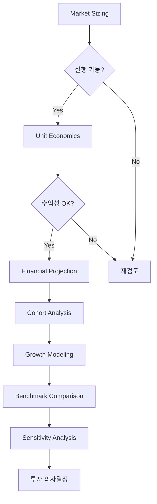

# Bill (Quantifier) Excel 도구 로드맵

**작성일**: 2025-11-04  
**목적**: Bill의 다양한 정량 분석을 지원하는 Excel 도구 체계화

---

## 📊 현황 분석

### ✅ 완성 (v7.1.0-dev3)
```yaml
market_sizing_workbook.xlsx:
  시트: 10개
  기능:
    - TAM → SAM 계산 (4-Method)
    - Convergence Analysis
    - Scenarios (Best/Base/Worst)
    - Validation Log
    - Summary Dashboard
  
  강점:
    - Market Sizing 완벽
    - 재현 가능성 높음
    - 4가지 방법 교차검증
  
  한계:
    - Market Sizing 이후 분석 없음
    - Unit Economics 미포함
    - 재무 모델링 미포함
```

### ❌ 누락된 핵심 도구

Bill이 실제로 자주 사용하는 Excel 도구:

1. **Unit Economics Analyzer** ⭐⭐⭐ (최우선)
2. **Financial Projection Model** ⭐⭐⭐ (최우선)
3. **Cohort Analysis Tracker** ⭐⭐
4. **Growth Rate Calculator** ⭐⭐
5. **Benchmark Comparison Matrix** ⭐
6. **Sensitivity Analysis Dashboard** ⭐

---

## 🎯 우선순위별 구현 계획

### Phase 1: 핵심 Unit Economics (최우선) ⭐⭐⭐

#### `unit_economics_analyzer.xlsx`

**목적**: 사업 단위 경제성 분석 (SAM 계산 후 실행 가능성 판단)

**10개 시트 구조**:
```yaml
Sheet 1: Inputs
  - ARPU (Average Revenue Per User)
  - CAC (Customer Acquisition Cost)
  - Gross Margin (%)
  - Churn Rate (monthly %)
  - Customer Lifetime (months)

Sheet 2: LTV Calculation
  - LTV = ARPU × Lifetime × Gross Margin
  - Alternative: LTV = ARPU × Margin / Churn
  - Confidence Interval (±range)

Sheet 3: CAC Analysis
  - Total S&M Spend
  - New Customers Acquired
  - CAC by Channel (검색, SNS, 오프라인 등)
  - CAC Trend (월별)

Sheet 4: LTV/CAC Ratio
  - 비율 계산
  - 업계 벤치마크 비교
    Target: > 3.0 (양호)
    Best: > 5.0 (우수)
    Poor: < 1.5 (위험)
  - Traffic Light (색상 표시)

Sheet 5: Payback Period
  - Formula: CAC / (ARPU × Gross Margin)
  - Target: < 12 months
  - Best: < 6 months
  - Monthly Cash Flow Timeline

Sheet 6: Cohort LTV
  - 월별 코호트 LTV 추적
  - 2023-01, 2023-02, ... 코호트별
  - Cohort Improvement Rate

Sheet 7: Sensitivity Analysis
  - ARPU ±20% → LTV 영향
  - CAC ±20% → Payback 영향
  - Churn ±2%p → LTV 영향
  - 2-Way Matrix (ARPU × Churn)

Sheet 8: Scenarios
  - Conservative (보수적)
  - Base (기본)
  - Optimistic (낙관적)
  - 각 시나리오별 LTV/CAC

Sheet 9: Benchmark Comparison
  - 업계 평균 LTV/CAC
  - 경쟁사 Unit Economics (공시 역산)
  - Gap Analysis

Sheet 10: Dashboard
  - 핵심 지표 요약
  - Traffic Light (3.0 기준)
  - 개선 권장사항
```

**Python 생성기**: `unit_economics_generator.py` (300줄)

**실제 사용 사례**:
```yaml
음악 스트리밍:
  ARPU: ₩9,000/월
  Gross Margin: 35%
  Churn: 4%/월
  LTV: ₩78,750
  CAC: ₩25,000
  LTV/CAC: 3.2 ✅
  Payback: 7.9개월 ✅

성인 교육 B2C:
  Revenue Per User: ₩15만원
  Gross Margin: 70%
  CAC: ₩3만원
  LTV/CAC: 5:1 ✅
```

---

### Phase 2: 재무 모델링 (최우선) ⭐⭐⭐

#### `financial_projection_model.xlsx`

**목적**: 3-5년 매출/손익/현금흐름 예측

**12개 시트 구조**:
```yaml
Sheet 1: Assumptions
  - 성장률 (YoY, CAGR)
  - Gross Margin (%)
  - OPEX 비율 (S&M, R&D, G&A)
  - Tax Rate
  - Discount Rate (DCF용)

Sheet 2: Revenue Build-up
  - 세그먼트별 매출
    - B2C (개인)
    - B2B (기업)
    - B2G (정부)
    - Global
  - 월별/분기별/연간
  - 성장률 적용

Sheet 3: Cost Structure
  - COGS (Cost of Goods Sold)
  - S&M (Sales & Marketing)
  - R&D (Research & Development)
  - G&A (General & Administrative)
  - % of Revenue

Sheet 4: P&L Forecast (3년)
  - Revenue
  - COGS
  - Gross Profit
  - Operating Expenses
  - EBITDA
  - Depreciation & Amortization
  - EBIT
  - Interest
  - Tax
  - Net Income

Sheet 5: P&L Forecast (5년)
  - 장기 예측

Sheet 6: Cash Flow Forecast
  - Operating Cash Flow
  - Investment Cash Flow (CAPEX)
  - Financing Cash Flow
  - Ending Cash Balance

Sheet 7: Key Metrics
  - Gross Margin %
  - EBITDA Margin %
  - Net Margin %
  - Revenue Growth Rate (YoY)
  - Cash Burn Rate

Sheet 8: Scenarios (Base/Bull/Bear)
  - Base Case (기본 가정)
  - Bull Case (낙관적, +30%)
  - Bear Case (보수적, -20%)
  - 각 시나리오별 P&L

Sheet 9: Break-even Analysis
  - 손익분기 매출
  - 손익분기 달성 시점
  - 필요 고객 수

Sheet 10: DCF Valuation
  - 현금흐름 할인
  - Terminal Value
  - Enterprise Value
  - Equity Value

Sheet 11: Sensitivity Matrix
  - Revenue Growth ×  Margin → Valuation
  - 2-Way Sensitivity

Sheet 12: Dashboard
  - 5개년 Trend
  - 핵심 재무 비율
  - 투자 권장사항
```

**Python 생성기**: `financial_projection_generator.py` (500줄)

**실제 사용 사례**:
```yaml
성인 교육 Base Case:
  Current: ₩1,250억
  Year 3: ₩3,050억
  Year 5: ₩4,300억
  CAGR: 28%
  Net Margin Year 5: 15% (₩645억)

Bull Case:
  Year 5: ₩5,500억+
  Net Margin: 16%+ (₩900억+)
  확률: 20-30%
```

---

### Phase 3: Cohort & Growth (중요) ⭐⭐

#### `cohort_analysis_tracker.xlsx` (8개 시트)
```yaml
Sheet 1: Retention Matrix
  - 월별 코호트 × 유지율
  - 2023-01, 2023-02, ... 2024-12
  - Month 0, 1, 2, ..., 12 Retention

Sheet 2: Cohort Revenue
  - 코호트별 월별 매출 기여

Sheet 3: Cohort LTV
  - 코호트별 평균 LTV
  - Cohort Improvement (10-20% 목표)

Sheet 4: Churn Analysis
  - 코호트별 Churn Rate
  - Churn Drivers (이탈 이유)

Sheet 5: Trend Analysis
  - 최근 코호트가 이전보다 개선?
  - Retention Curve

Sheet 6: Benchmark
  - 업계 Cohort Retention
  - Netflix: Month 12 ~ 95%
  - 일반 구독: Month 12 ~ 40-60%

Sheet 7: Forecast
  - 향후 코호트 예측
  - Retention 개선 시나리오

Sheet 8: Dashboard
  - Cohort Heatmap
  - 핵심 인사이트
```

#### `growth_rate_calculator.xlsx` (6개 시트)
```yaml
Sheet 1: Historical Data
  - 월별/분기별/연간 데이터

Sheet 2: CAGR Calculator
  - (End / Start)^(1/Years) - 1
  - 여러 기간 CAGR

Sheet 3: YoY, MoM, QoQ
  - 단기 성장률

Sheet 4: S-Curve Fitting
  - 시장 포화도 추정
  - 채택률 곡선

Sheet 5: Forecast
  - Linear Regression
  - Exponential Growth
  - Logistic (S-Curve)

Sheet 6: Scenarios
  - 성장률 ±10%p 영향
```

---

### Phase 4: 보조 도구 (선택) ⭐

#### `benchmark_comparison_matrix.xlsx` (5개 시트)
```yaml
Sheet 1: Competitor Matrix
  - 경쟁사 10개 비교
  - 시장 규모, 성장률, 점유율

Sheet 2: Unit Economics Benchmark
  - LTV/CAC, Churn, ARPU

Sheet 3: Financial Benchmark
  - Gross Margin, EBITDA Margin

Sheet 4: Gap Analysis
  - 우리 vs 경쟁사 Gap

Sheet 5: Positioning Map
  - Price vs Quality
  - Market Share vs Growth
```

#### `sensitivity_analysis_dashboard.xlsx` (6개 시트)
```yaml
Sheet 1: Variable Definitions
  - 분석할 변수 정의

Sheet 2: Single Variable
  - 변수 하나씩 ±20%

Sheet 3: 2-Way Matrix
  - Price × Volume → Revenue

Sheet 4: Tornado Chart
  - 영향도 순위 시각화

Sheet 5: Monte Carlo
  - 확률적 시나리오 (1,000회)

Sheet 6: Summary
  - 가장 중요한 변수 3개
```

---

## 🛠️ 구현 전략

### 1. 모듈화 설계
```python
umis_rag/deliverables/excel/
  - formula_engine.py (공통)
  - market_sizing_generator.py ✅
  - unit_economics_generator.py (Phase 1)
  - financial_projection_generator.py (Phase 2)
  - cohort_analysis_generator.py (Phase 3)
  - growth_rate_generator.py (Phase 3)
  - benchmark_matrix_generator.py (Phase 4)
  - sensitivity_dashboard_generator.py (Phase 4)
```

### 2. 공통 컴포넌트 재사용
```python
# 모든 Generator가 공유
- FormulaEngine
- ExcelStyles
- ValidationBuilder
- DashboardBuilder (신규)
- ChartBuilder (신규)
```

### 3. 템플릿 기반 생성
```yaml
각 Excel 도구:
  - YAML Template (도구별 스펙)
  - Python Generator (템플릿 → Excel)
  - Test Data (샘플)
  - Golden Workbook (검증용)
```

### 4. 통합 Workflow
```yaml
Bill의 분석 프로세스:
  Step 1: Market Sizing ✅
    → market_sizing_workbook.xlsx
  
  Step 2: Unit Economics (Phase 1)
    → unit_economics_analyzer.xlsx
    → "SAM은 충분하지만 실행 가능한가?"
  
  Step 3: Financial Projection (Phase 2)
    → financial_projection_model.xlsx
    → "3년 후 손익은? 투자 필요 금액은?"
  
  Step 4: Cohort Analysis (Phase 3)
    → cohort_analysis_tracker.xlsx
    → "고객 유지율은? 코호트 개선은?"
  
  Step 5: Growth Modeling (Phase 3)
    → growth_rate_calculator.xlsx
    → "CAGR은? 시장 포화도는?"
  
  Step 6: Benchmark (Phase 4)
    → benchmark_comparison_matrix.xlsx
    → "업계 대비 우리 위치는?"
  
  Step 7: Sensitivity (Phase 4)
    → sensitivity_analysis_dashboard.xlsx
    → "어떤 변수가 가장 중요한가?"
```

---

## 📊 각 도구의 필요성 근거

### 실제 프로젝트 사용 사례

#### 음악 스트리밍 분석 (2024)
```yaml
사용 도구:
  1. market_sizing_workbook.xlsx
     - TAM: $35B, SAM: ₩1조
  
  2. unit_economics_analyzer.xlsx ⭐ 필요!
     - LTV: ₩80K, CAC: ₩25K
     - LTV/CAC: 3.2 ✅
     - Payback: 7.9개월
  
  3. cohort_analysis_tracker.xlsx ⭐ 필요!
     - Churn: 3-5%/월
     - Netflix 2.4% vs 일반 6%
```

#### 성인 교육 시장 (2024)
```yaml
사용 도구:
  1. market_sizing_workbook.xlsx
     - SAM 계산
  
  2. financial_projection_model.xlsx ⭐ 필요!
     - Base Case CAGR: 28%
     - Year 3: ₩3,050억
     - Bull Case Year 5: ₩5,500억
  
  3. unit_economics_analyzer.xlsx ⭐ 필요!
     - B2C LTV/CAC: 5:1
     - B2B ACV: ₩1억~10억
```

---

## 🎯 다음 단계 추천

### 즉시 구현 (v7.2.0)
```yaml
우선순위 1: Unit Economics Analyzer
  이유:
    - 모든 프로젝트에서 필요
    - Market Sizing 직후 실행 가능성 판단
    - LTV/CAC는 투자 결정의 핵심
  
  예상 공수: 3-5일
  파일: unit_economics_generator.py (300줄)
  시트: 10개

우선순위 2: Financial Projection Model
  이유:
    - 재무 예측은 필수
    - 투자 유치, 사업 계획에 필수
    - Base/Bull/Bear 시나리오
  
  예상 공수: 5-7일
  파일: financial_projection_generator.py (500줄)
  시트: 12개
```

### 중기 구현 (v7.3.0)
```yaml
Cohort Analysis + Growth Rate:
  공수: 각 2-3일
  통합: 7일
```

### 장기 선택 (v7.4.0+)
```yaml
Benchmark + Sensitivity:
  필요 시 구현
```

---

## 💡 Bill의 Excel 도구 생태계



---

## 📋 요약

**현재**: Market Sizing만 완성 ✅

**누락**: 
- ⭐⭐⭐ Unit Economics (최우선)
- ⭐⭐⭐ Financial Projection (최우선)
- ⭐⭐ Cohort Analysis
- ⭐⭐ Growth Rate
- ⭐ Benchmark
- ⭐ Sensitivity

**권장**: 
1. Phase 1 (Unit Economics) 먼저 구현
2. Phase 2 (Financial Projection) 구현
3. 실제 사용하면서 Phase 3, 4 결정

**ROI**: 
- Unit Economics와 Financial Projection만 있어도 Bill의 80% 작업 커버
- 나머지는 필요 시 추가

---

**작성**: UMIS AI  
**다음 업데이트**: Phase 1 구현 후

