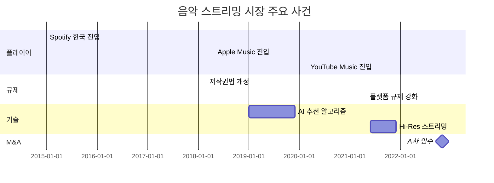
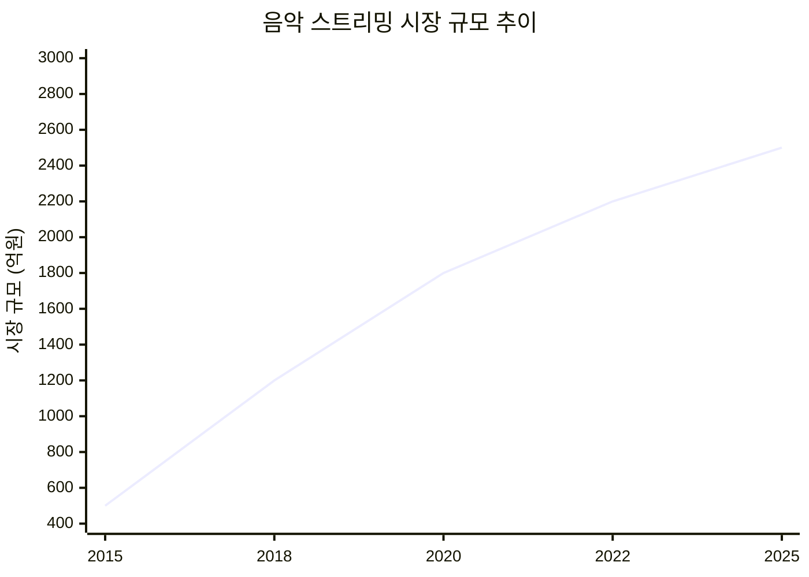

# Mermaid Timeline 템플릿
**목적**: market_timeline_analysis.md 자동 생성용
**버전**: v7.8.0
**생성일**: 2025-11-12

---

## Template 1: Market Events Gantt Chart

### 용도
주요 사건 타임라인 (플레이어 진입/퇴출, 규제, 기술, M&A)

### 템플릿

```mermaid
gantt
    title {market_name} 시장 주요 사건
    dateFormat YYYY-MM
    
    section 플레이어
    {player_1} 진입    :{year1}-01, {year1}-12
    {player_2} 진입    :{year2}-05, {year2}-12
    {player_3} 퇴출    :crit, {year3}-03, {year3}-03
    
    section 규제
    {regulation_1}    :crit, {year4}-06, {year4}-06
    {regulation_2}    :{year5}-09, {year5}-09
    
    section 기술
    {tech_1} 도입      :{year6}-01, {year6}-12
    {tech_2} 성숙      :{year7}-06, {year7}-12
    
    section M&A
    {ma_event_1}      :milestone, {year8}-11, {year8}-11
    {ma_event_2}      :{year9}-03, {year9}-03
```

### Python 생성 코드

```python
def generate_gantt_timeline(events: List[Dict]) -> str:
    """
    주요 사건 리스트 → Mermaid Gantt Chart
    
    Args:
        events: [
            {
                'year': 2015,
                'month': 1,
                'event': 'Spotify 한국 진입',
                'category': 'player',
                'impact': 'high'
            },
            ...
        ]
    
    Returns:
        mermaid_code: str
    """
    
    # 카테고리별 분류
    by_category = {
        'player': [],
        'regulation': [],
        'technology': [],
        'ma': []
    }
    
    for event in events:
        category = event.get('category', 'other')
        if category in by_category:
            by_category[category].append(event)
    
    # Mermaid 코드 생성
    lines = [
        "```mermaid",
        "gantt",
        f"    title {market_name} 시장 주요 사건",
        "    dateFormat YYYY-MM",
        ""
    ]
    
    # 섹션별 추가
    for section_name, section_events in by_category.items():
        if section_events:
            lines.append(f"    section {section_name}")
            
            for evt in section_events:
                year = evt['year']
                month = evt.get('month', 1)
                name = evt['event']
                impact = evt.get('impact', 'normal')
                
                # Critical 이벤트는 crit 마커
                marker = "crit, " if impact == 'high' else ""
                
                lines.append(
                    f"    {name:<30} :{marker}{year:04d}-{month:02d}, {year:04d}-{month:02d}"
                )
            
            lines.append("")
    
    lines.append("```")
    
    return "\n".join(lines)
```

### 예시 출력



---

## Template 2: Market Size Trend Line Chart

### 용도
연도별 시장 규모 변화 추이

### 템플릿

```mermaid
---
config:
  theme: base
  themeVariables:
    xyChart:
      plotColorPalette: "#2E86AB, #A23B72, #F18F01"
---
xychart-beta
    title "{market_name} 시장 규모 추이"
    x-axis [{years}]
    y-axis "시장 규모 (억원)" {min_value} --> {max_value}
    line [{values}]
```

### Python 생성 코드

```python
def generate_market_size_chart(
    market_name: str,
    trend_data: List[Tuple[int, float]]
) -> str:
    """
    시장 규모 추이 → Mermaid Line Chart
    
    Args:
        trend_data: [(year, size), ...]
            예: [(2015, 500), (2020, 1200), (2025, 2500)]
    
    Returns:
        mermaid_code: str
    """
    
    years = [str(year) for year, _ in trend_data]
    values = [size for _, size in trend_data]
    
    min_value = int(min(values) * 0.8)  # 20% 여유
    max_value = int(max(values) * 1.2)
    
    years_str = ", ".join(years)
    values_str = ", ".join(str(int(v)) for v in values)
    
    mermaid = f"""```mermaid
---
config:
  theme: base
---
xychart-beta
    title "{market_name} 시장 규모 추이"
    x-axis [{years_str}]
    y-axis "시장 규모 (억원)" {min_value} --> {max_value}
    line [{values_str}]
```"""
    
    return mermaid
```

### 예시 출력



---

## Template 3: Player Share Stacked Bar

### 용도
플레이어별 점유율 변화

### 템플릿 (간단 버전 - Markdown Table)

```markdown
## 플레이어 점유율 변화

| Player | 2015 | 2020 | 2025 | 변화 |
|--------|------|------|------|------|
| Spotify | 40% | 35% | 28% | ↓ -12%p |
| Apple Music | 30% | 35% | 42% | ↑ +12%p |
| YouTube Music | - | 20% | 22% | 신규 진입 |
| 기타 | 30% | 10% | 8% | ↓ -22%p |

### 시각화

[간단한 ASCII 차트 또는 Mermaid Pie Chart 연도별]
```

### Python 생성 코드

```python
def generate_player_share_table(
    player_data: Dict[str, List[Tuple[int, float]]]
) -> str:
    """
    플레이어별 점유율 → Markdown Table
    
    Args:
        player_data: {
            'Spotify': [(2015, 40), (2020, 35), (2025, 28)],
            'Apple': [(2015, 30), (2020, 35), (2025, 42)],
            ...
        }
    
    Returns:
        markdown_table: str
    """
    
    # 연도 추출 (첫 번째 플레이어 기준)
    first_player = list(player_data.values())[0]
    years = [year for year, _ in first_player]
    
    # 테이블 헤더
    year_cols = " | ".join(str(y) for y in years)
    lines = [
        f"| Player | {year_cols} | 변화 |",
        "|--------|" + "------|" * len(years) + "------|"
    ]
    
    # 각 플레이어 행
    for player_name, shares in player_data.items():
        share_values = [f"{share}%" for _, share in shares]
        
        # 변화 계산
        first_share = shares[0][1]
        last_share = shares[-1][1]
        change = last_share - first_share
        change_str = f"{'↑' if change > 0 else '↓'} {change:+.0f}%p"
        
        if first_share == 0:  # 신규 진입
            change_str = "신규 진입"
        
        share_cols = " | ".join(share_values)
        lines.append(f"| {player_name} | {share_cols} | {change_str} |")
    
    return "\n".join(lines)
```

---

## Template 4: HHI Trend (간단)

### Markdown Table

```markdown
## 시장 집중도 변화 (HHI)

| 연도 | HHI | 시장 구조 | 단계 |
|------|-----|-----------|------|
| 2015 | 8,000 | 고도 집중 | 독점기 |
| 2020 | 3,000 | 경쟁 | 경쟁기 |
| 2025 | 4,500 | 중간 집중 | 재편기 |

**패턴**: 독점 → 경쟁 → 재편 사이클 (RAG 패턴 매칭: evolution_001)
```

---

## 통합 예시: 완전한 Timeline Analysis

```markdown
# 음악 스트리밍 시장 타임라인 분석

## Executive Summary
2015-2025년 10년간 시장은 독점 → 경쟁 → 재편 단계를 거쳤음.
주요 변곡점: 2018년 (규제 완화), 2022년 (M&A 활발).
향후 2027년 AI 개인화 기술로 다음 변곡점 예상.

## 1. Market Size Evolution

### 연도별 추이
| 연도 | 시장 규모 | YoY | 주요 사건 |
|------|----------|-----|----------|
| 2015 | 500억 | - | - |
| 2018 | 1,200억 | +35% | 🔴 규제 완화 (변곡점) |
| 2020 | 1,800억 | +20% | COVID-19 |
| 2022 | 2,200억 | +10% | 🔴 M&A 활발 (변곡점) |
| 2025 | 2,500억 | +5% | - |

### 시각화
[Mermaid Line Chart]

### 변곡점 분석
1. **2018년 규제 완화**
   - 성장률: 15% → 35% (급증)
   - 원인: 저작권법 개정
   - 영향: 신규 플레이어 진입 촉진

2. **2022년 M&A 활발**
   - 성장률: 20% → 10% (둔화)
   - 원인: 시장 성숙, 경쟁 심화
   - 영향: 시장 재편 시작

## 2. Player Dynamics

[Player Share Table]

## 3. Structural Evolution

### HHI 추이
[HHI Table]

### 패턴 매칭
**RAG 매칭**: evolution_001 "독점 → 경쟁 → 재편 사이클" (유사도 0.92)
**참조 사례**: 통신 시장 (1980-현재)

## 4. Key Events Timeline

[Mermaid Gantt Chart]

## 5. Future Implications

### 다음 변곡점 예상
- **연도**: 2027년
- **촉발 요인**: AI 개인화 기술 성숙
- **예상 영향**: 고객 경험 혁신, 이탈률 감소

### 성장 전망
- 2026년: 2,700억 (CAGR 4%, 신뢰도 0.8)
- 2028년: 2,900억 (CAGR 3%, 신뢰도 0.6)
```

---

**문서 끝**

