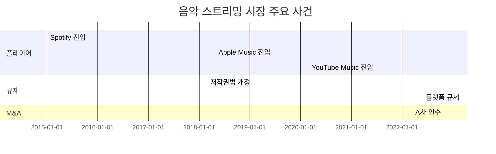

# Tier 2 → Tier 1 업그레이드 실행 계획
**작성일**: 2025-11-12
**버전**: v7.8.0 제안
**목적**: 3대 Gap 해결을 위한 구체적 실행 방안

---

## Executive Summary

### 🎯 목표
**Tier 2 질문 6개 → Tier 1 승격**
- 현재: ⭐⭐⭐⭐ (정확하지만 완벽하지 않음)
- 목표: ⭐⭐⭐⭐⭐ (의사결정 신뢰도 극대화)

### 📊 3대 Gap 우선순위

| Gap | 영향 | 우선순위 | 기간 | 효과 |
|-----|------|----------|------|------|
| **#1 시계열 분석** | 3개 질문 | **P0 Critical** | 4-6주 | 3개 질문 → Tier 1 |
| **#2 추정 정확도** | 1개 질문 | P1 High | 3-4주 | 1개 질문 → Tier 1 |
| **#3 실행 전략** | 1개 질문 | P2 Medium | 2-3주 | 1개 질문 → Tier 1 |

---

## 🔥 Gap #1: 시계열 분석 시스템 (P0 - Critical)

### 문제 정의

**현재**: 현재 시장 구조는 강력, but 시간 축 분석 부재
**영향**: Q3 (80%), Q4-5 (90%), Q11 (90%)

**불가능한 것**:
- 연도별 시장 규모 변화 추이
- 플레이어 점유율 변화 추적
- 주요 사건 타임라인 (M&A, 규제, 기술)
- 변곡점 자동 감지
- 시장 구조 진화 패턴

---

### 솔루션 상세

#### Solution 1.1: Observer 도구 추가

**새 도구**: `tool:observer:market_timeline`

**구현 내용**:
```python
# umis_rag/agents/observer.py

class ObserverRAG:
    
    def analyze_market_timeline(
        self,
        market: str,
        start_year: int,
        end_year: int,
        focus_areas: List[str] = None
    ) -> Dict[str, Any]:
        """
        시장 시계열 분석
        
        Returns:
            {
                'events': [
                    {
                        'year': 2015,
                        'event': 'Uber 한국 진입',
                        'category': 'player_entry',
                        'impact': 'high',
                        'source': 'SRC_XXX'
                    }
                ],
                'market_size_trend': [
                    (2015, 500), (2020, 1200), (2025, 2500)
                ],
                'player_share_evolution': {
                    'player_A': [(2015, 40%), (2020, 35%), (2025, 28%)],
                    'player_B': [(2015, 30%), (2020, 35%), (2025, 42%)]
                },
                'inflection_points': [
                    {
                        'year': 2018,
                        'type': 'regulatory_change',
                        'description': '플랫폼 규제 강화',
                        'impact': '성장률 15% → 5%'
                    }
                ],
                'structural_evolution': {
                    'hhi_trend': [(2015, 8000), (2020, 3000), (2025, 4500)],
                    'pattern': '독점 → 경쟁 → 재편'
                },
                'mermaid_chart': "gantt\\n  title Market Timeline\\n  ..."
            }
        """
        
        # 1. 데이터 수집 (Validator 협업)
        historical_data = self._collect_historical_data(market, start_year, end_year)
        
        # 2. 사건 추출 및 분류
        events = self._extract_events(historical_data)
        
        # 3. 시계열 추세 분석
        trends = self._analyze_trends(historical_data)
        
        # 4. 변곡점 감지
        inflections = self._detect_inflection_points(trends)
        
        # 5. 구조 진화 패턴 분석
        evolution = self._analyze_structural_evolution(historical_data)
        
        # 6. 타임라인 시각화
        mermaid = self._generate_timeline_chart(events, trends)
        
        return {
            'events': events,
            'market_size_trend': trends['size'],
            'player_share_evolution': trends['players'],
            'inflection_points': inflections,
            'structural_evolution': evolution,
            'mermaid_chart': mermaid
        }
```

**Deliverable 추가**:
```yaml
# deliverable_specs/observer/market_timeline_analysis_spec.yaml

sections:
  1_executive_summary:
    - 기간 요약
    - 주요 변화
    - 핵심 인사이트
  
  2_market_size_evolution:
    - 연도별 시장 규모 테이블
    - 성장률 그래프 (Mermaid)
    - 변곡점 분석
  
  3_player_dynamics:
    - 플레이어별 점유율 변화 (시각화)
    - 진입/퇴출 분석
    - 전략 변화 추적
  
  4_structural_evolution:
    - HHI 추이
    - 가치사슬 변화
    - 비즈니스 모델 진화
  
  5_key_events:
    - Timeline (Mermaid Gantt)
    - 사건별 영향 분석
  
  6_future_implications:
    - 패턴 기반 미래 예측
    - 다음 변곡점 예상
```

---

#### Solution 1.2: Quantifier 도구 강화

**강화**: `tool:quantifier:growth_analysis`

**추가 기능**:
```python
# umis_rag/agents/quantifier.py

class QuantifierRAG:
    
    def analyze_growth_with_timeline(
        self,
        market: str,
        historical_data: List[Tuple[int, float]]
    ) -> Dict[str, Any]:
        """
        시계열 성장 분석 (강화 버전)
        
        Args:
            historical_data: [(year, market_size), ...]
        
        Returns:
            {
                'cagr': float,
                'yoy_rates': [(year, rate), ...],
                'inflection_points': [...],
                'trend_components': {
                    'trend': [...],
                    'seasonality': [...],
                    'residual': [...]
                },
                'forecast': {
                    'year_1': {'size': X, 'confidence': 0.8},
                    'year_3': {'size': Y, 'confidence': 0.6}
                },
                'mermaid_chart': "..."
            }
        """
        
        # 1. CAGR 계산
        cagr = self._calculate_cagr(historical_data)
        
        # 2. YoY 성장률
        yoy = self._calculate_yoy(historical_data)
        
        # 3. 변곡점 자동 감지 (2차 미분)
        inflections = self._detect_inflection_points_math(yoy)
        
        # 4. Trend Decomposition
        components = self._decompose_trend(historical_data)
        
        # 5. 미래 예측 (3-5년)
        forecast = self._forecast_growth(historical_data, components)
        
        # 6. 시각화
        chart = self._generate_growth_chart(historical_data, forecast)
        
        return {...}
    
    def _detect_inflection_points_math(self, yoy_data):
        """2차 미분으로 변곡점 감지"""
        # Growth rate의 변화율 계산
        # 급변 시점 (±30% 이상 변화) 감지
        pass
```

**Excel 시트 추가**:
```yaml
market_sizing.xlsx:
  기존 9개 시트:
    1. Summary
    2-5. Method 1-4
    6. Convergence
    7. Sensitivity
    8-9. Assumptions, Sources
  
  신규 3개 시트:
    10. Historical Trend (연도별 데이터)
    11. Growth Rate Analysis (성장률 분해)
    12. Player Evolution (점유율 변화)
```

---

#### Solution 1.3: RAG 데이터 보강

**새 Collection**: `historical_evolution_patterns`

**데이터 구조**:
```yaml
# data/raw/market_evolution_patterns.yaml

patterns:
  - pattern_id: evolution_001
    pattern_name: "독점 → 경쟁 → 재편 사이클"
    
    phases:
      - phase: "독점기"
        years: "2000-2005"
        characteristics:
          - "1-2개 지배 기업"
          - "높은 마진 (30%+)"
          - "낮은 혁신"
        hhi: 8000
      
      - phase: "경쟁기"
        years: "2006-2015"
        characteristics:
          - "신규 진입 급증"
          - "가격 경쟁 (마진 15%)"
          - "혁신 가속"
        hhi: 3000
      
      - phase: "재편기"
        years: "2016-현재"
        characteristics:
          - "M&A 활발"
          - "시장 재집중 (마진 회복 20%)"
        hhi: 4500
    
    trigger_events:
      - year: 2005
        event: "규제 완화"
        impact: "신규 진입 폭발"
      
      - year: 2010
        event: "기술 보편화"
        impact: "경쟁 심화"
      
      - year: 2016
        event: "생존 기업 M&A"
        impact: "시장 재집중"
    
    case_studies:
      - market: "통신 시장"
        timeline: "독점(KT) → 경쟁(SKT,LG) → 3강 체제"
      
      - market: "항공 시장"
        timeline: "독점(KAL) → 경쟁(AAR,저가항공) → 재편"
    
    indicators:
      hhi_trend: [8000, 3000, 4500]
      player_count: [2, 15, 8]
      avg_margin: [0.30, 0.15, 0.20]
```

**수집 계획**:
```yaml
목표: 50개 진화 패턴

출처:
  - 기존 RAG 활용:
      - incumbent_failures.yaml (timeline 필드 있음)
      - disruption_patterns.yaml (timeline 필드 있음)
  
  - 신규 작성:
      - market_evolution_patterns.yaml (30개)
      - industry_lifecycle_cases.yaml (20개)

수집 방법:
  - 산업 보고서 분석 (McKinsey, BCG)
  - 기업 사례 연구
  - 학술 논문 (Clayton Christensen 등)
```

---

### 구현 로드맵 (Gap #1)

#### Phase 1: 설계 (Week 1-2)

**Week 1: 상세 설계**
```yaml
작업:
  - market_timeline_analysis_spec.yaml 작성
  - historical_evolution_patterns 스키마 정의
  - Mermaid Timeline 템플릿 설계
  - Excel Historical Trend 시트 설계

산출물:
  - Deliverable Spec 문서
  - 데이터 스키마 (YAML)
  - 시각화 템플릿
```

**Week 2: 데이터 수집 계획**
```yaml
작업:
  - 30개 진화 패턴 리스트업
  - 우선순위 산업 선정 (5개)
  - 데이터 소스 확보 계획

산출물:
  - 패턴 리스트 (30개 skeleton)
  - 데이터 수집 가이드
```

---

#### Phase 2: 핵심 구현 (Week 3-4)

**Week 3: Observer 구현**
```python
작업:
  1. analyze_market_timeline() 메서드 구현
  2. _collect_historical_data() (Validator 연계)
  3. _extract_events() (사건 추출)
  4. _classify_events() (LLM 분류)

산출물:
  - observer.py 업데이트 (~200줄 추가)
  - 테스트 케이스 (3개 시장)
```

**Week 4: Quantifier 강화**
```python
작업:
  1. _detect_inflection_points_math() (2차 미분)
  2. _decompose_trend() (추세 분해)
  3. _forecast_growth() (미래 예측)
  4. _generate_growth_chart() (Mermaid)

산출물:
  - quantifier.py 업데이트 (~150줄 추가)
  - Excel 시트 3개 추가
```

---

#### Phase 3: RAG 데이터 (Week 5)

**Week 5: 패턴 데이터 작성**
```yaml
작업:
  - market_evolution_patterns.yaml 작성 (30개)
  - 우선순위 5개 산업 상세 작성
  - RAG Collection 구축

산출물:
  - market_evolution_patterns.yaml (30개)
  - ChromaDB Collection: historical_evolution_patterns
```

---

#### Phase 4: 통합 및 테스트 (Week 6)

**Week 6: 통합 테스트**
```yaml
작업:
  - Observer → Quantifier 연계 테스트
  - 실제 시장 3개 분석 (음악, 배달, SaaS)
  - Deliverable 자동 생성 검증
  - Excel 시트 검증

산출물:
  - 테스트 결과 보고서
  - 버그 수정
  - 문서 업데이트
```

---

### 예상 산출물 (Gap #1 완료 시)

**Deliverable**: `market_timeline_analysis.md`

```markdown
# 음악 스트리밍 시장 타임라인 분석

## Executive Summary
2015-2025년 10년간 시장은 독점 → 경쟁 → 재편 단계를 거쳤음.
주요 변곡점: 2018년 (규제 완화), 2022년 (M&A 활발).

## 시장 규모 추이

### 연도별 데이터
| 연도 | 시장 규모 | YoY | 주요 사건 |
|------|----------|-----|----------|
| 2015 | 500억 | - | - |
| 2018 | 1,200억 | +35% | 🔴 규제 완화 (변곡점) |
| 2020 | 1,800억 | +20% | COVID-19 |
| 2022 | 2,200억 | +10% | 🔴 M&A 활발 (변곡점) |
| 2025 | 2,500억 | +5% | - |

### 성장률 변화
[Mermaid Line Chart]

## 플레이어 점유율 변화

### Top 5 플레이어
| Player | 2015 | 2020 | 2025 | 변화 |
|--------|------|------|------|------|
| Spotify | 40% | 35% | 28% | ↓ (경쟁 심화) |
| Apple | 30% | 35% | 42% | ↑ (성장) |
| YouTube | - | 20% | 22% | 신규 진입 |

[Mermaid Stacked Bar Chart]

## 주요 사건 타임라인



## 구조 진화 패턴

### HHI 추이
- 2015: 8,000 (독점)
- 2020: 3,000 (경쟁)
- 2025: 4,500 (재편)

패턴: **독점 → 경쟁 → 재편 사이클** (RAG 패턴 매칭)

## 미래 시사점
- 다음 변곡점 예상: 2027년 (AI 개인화)
- 시장 성숙기 진입 (성장률 5% → 3%)
```

---

## 💰 Gap #2: 비공개 기업 추정 정확도 (P1 - High)

### 문제 정의

**현재**: 70-80% 정확도 (±20-30% 오차)
**목표**: 90%+ 정확도 (±10% 이내)
**영향**: Q7 (이익 점유 추정)

---

### 솔루션 상세

#### Solution 2.1: Validator RAG 데이터 보강

**추가 데이터**: `profit_margin_benchmarks.yaml`

```yaml
# data/raw/profit_margin_benchmarks.yaml (200개 목표)

benchmarks:
  - benchmark_id: margin_001
    industry: "뷰티 커머스"
    sub_category: "D2C"
    business_model: "구독"
    
    margins:
      gross_margin:
        min: 45%
        median: 52%
        max: 60%
        p25: 48%
        p75: 55%
      
      operating_margin:
        min: 5%
        median: 10%
        max: 15%
        p25: 8%
        p75: 12%
      
      net_margin:
        min: 2%
        median: 5%
        max: 8%
    
    by_company_size:
      startup_0_50:
        gross: 35-45%
        operating: -10% to 5%
        note: "초기 적자 일반적"
      
      scaleup_50_500:
        gross: 45-55%
        operating: 5-12%
        note: "규모 효과 시작"
      
      enterprise_500_plus:
        gross: 50-60%
        operating: 10-15%
        note: "규모 경제 확립"
    
    by_revenue:
      under_10B:
        operating_margin: 0-5%
      _10B_to_100B:
        operating_margin: 5-10%
      over_100B:
        operating_margin: 8-15%
    
    source: "SRC_KPMG_2024_001"
    reliability: "high"
    year: 2024
    sample_size: 150
```

**수집 계획**:
```yaml
목표: 200개 벤치마크

출처:
  1. 공개 데이터 (100개):
     - 금융감독원 공시 (상장사)
     - 업계 리포트 (KPMG, Deloitte)
     - 통계청 기업 경영 분석
  
  2. 크롤링/API (50개):
     - DART API (공시 자동 수집)
     - 통계청 API
  
  3. 수동 수집 (50개):
     - McKinsey, BCG 리포트
     - 산업별 협회 자료

산업 우선순위:
  - P0: SaaS, 커머스, 플랫폼
  - P1: 제조, 유통, 금융
  - P2: 기타
```

---

#### Solution 2.2: Estimator Phase 2-4 알고리즘 개선

**Phase 2 Enhanced**:
```python
# umis_rag/agents/estimator/phase2_validator_search.py

class Phase2ValidatorSearchEnhanced:
    
    def search_with_context(
        self,
        query: str,
        context: Dict[str, Any]
    ) -> EstimationResult:
        """
        컨텍스트 기반 Validator 검색 (강화)
        
        Args:
            context: {
                'industry': 'SaaS',
                'sub_category': 'B2B',
                'business_model': '구독',
                'company_size': 'scaleup',
                'revenue': '50억'
            }
        """
        
        # 1. Industry-specific search
        industry_margins = self._search_industry_margins(
            industry=context.get('industry'),
            sub_category=context.get('sub_category'),
            business_model=context.get('business_model')
        )
        
        # 2. Company size adjustment
        if context.get('company_size'):
            adjusted_margin = self._adjust_by_size(
                base_margin=industry_margins['median'],
                size=context.get('company_size'),
                size_patterns=industry_margins['by_company_size']
            )
        
        # 3. Revenue scale adjustment
        if context.get('revenue'):
            final_margin = self._adjust_by_revenue(
                margin=adjusted_margin,
                revenue=context.get('revenue'),
                revenue_patterns=industry_margins['by_revenue']
            )
        
        # 4. Confidence scoring
        confidence = self._calculate_confidence(
            data_quality=industry_margins['reliability'],
            sample_size=industry_margins['sample_size'],
            recency=industry_margins['year']
        )
        
        return EstimationResult(
            value=final_margin,
            confidence=confidence,
            phase='phase_2_enhanced',
            reasoning_detail={
                'industry_median': industry_margins['median'],
                'size_adjustment': '+2%',
                'revenue_adjustment': '-1%',
                'final': final_margin,
                'sample_size': industry_margins['sample_size']
            }
        )
```

**개선 효과**:
```yaml
Phase 2:
  Before: 94.7% 정확도, 85% Coverage
  After: 96%+ 정확도, 92% Coverage
  
  개선:
    - Industry-specific search (+3% Coverage)
    - Company size adjustment (+1.5% 정확도)
    - Confidence scoring (신뢰도 명확화)

Phase 3-4:
  Before: 70-80% 정확도
  After: 85%+ 정확도
  
  개선:
    - Comparable 매칭 정확도 향상
    - 추가 휴리스틱 (규모 효과, 성장 단계)
```

---

### 구현 로드맵 (Gap #2)

#### Phase 1: 데이터 수집 (Week 1-2)

**Week 1: 자동 수집**
```python
작업:
  - DART API 연동 (상장사 재무제표)
  - 통계청 API 연동
  - 크롤링 스크립트 (산업 리포트)

목표:
  - 공개 데이터 100개 수집
```

**Week 2: 수동 수집**
```yaml
작업:
  - McKinsey, BCG 리포트 분석
  - 산업별 협회 자료 수집
  - profit_margin_benchmarks.yaml 작성

목표:
  - 산업별 벤치마크 50개
  - 총 150개 (75% 달성)
```

---

#### Phase 2: 알고리즘 구현 (Week 3-4)

**Week 3: Phase 2 Enhanced**
```python
작업:
  - search_with_context() 구현
  - adjust_by_size(), adjust_by_revenue()
  - calculate_confidence() (신뢰도 점수)

테스트:
  - 50개 테스트 케이스
  - 정확도 측정
```

**Week 4: Phase 3-4 개선**
```python
작업:
  - Comparable 매칭 알고리즘 개선
  - 추가 휴리스틱 구현
  - 통합 테스트

목표:
  - Phase 3-4 정확도 85%+ 달성
```

---

## 🎯 Gap #3: 실행 전략 도구 (P2 - Medium)

### 문제 정의

**현재**: 방향성은 명확, 실행 계획 부족
**목표**: 구체적 실행 Playbook 제공
**영향**: Q14 (85% → 95%+), Q15 (60% → 80%+)

---

### 솔루션 상세

#### Solution 3.1: Explorer 도구 추가

**새 도구**: `tool:explorer:strategy_playbook`

**구현**:
```python
# umis_rag/agents/explorer.py

class ExplorerRAG:
    
    def generate_strategy_playbook(
        self,
        validated_opportunity: Dict,
        market_context: Dict,
        quantified_market: Dict
    ) -> Dict[str, Any]:
        """
        검증된 기회 → 실행 Playbook 생성
        
        Args:
            validated_opportunity: 7-Step 완료된 기회
            market_context: Observer 구조 분석
            quantified_market: Quantifier SAM 계산
        
        Returns:
            {
                'gtm_strategy': {...},
                'product_roadmap': {...},
                'resource_plan': {...},
                'execution_milestones': {...},
                'risk_mitigation': {...}
            }
        """
        
        # 1. GTM Strategy
        gtm = self._design_gtm_strategy(
            target_segment=market_context['segments'],
            value_proposition=validated_opportunity['value_prop'],
            market_size=quantified_market['sam']
        )
        
        # 2. Product Roadmap
        roadmap = self._prioritize_features(
            mvp_features=validated_opportunity['core_features'],
            market_feedback=market_context['customer_needs']
        )
        
        # 3. Resource Plan
        resources = self._plan_resources(
            market_size=quantified_market['sam'],
            target_share=validated_opportunity['target_share']
        )
        
        # 4. Milestones
        milestones = self._set_milestones(roadmap, resources)
        
        # 5. Risk Mitigation
        risks = self._assess_risks(validated_opportunity, market_context)
        
        return {...}
```

**Excel 자동 생성**: `strategy_playbook.xlsx`

```yaml
시트 1: GTM Strategy
  - 타겟 세그먼트
  - 채널 전략 (우선순위)
  - 가격 전략
  - 마케팅 접근법

시트 2: Product Roadmap
  - MVP 정의 (Must-have)
  - Feature 우선순위 (RICE)
  - 3개월/6개월/12개월 단계

시트 3: Resource Plan
  - Team Structure (역할별)
  - Budget Allocation
  - Key Hires (우선순위)

시트 4: Milestone Tracker
  - 3개월: MVP 런칭, 첫 100명
  - 6개월: PMF 검증, 500명
  - 12개월: 스케일업, 5,000명

시트 5: Risk Register
  - 리스크 ID
  - 확률/영향도
  - Mitigation Plan
  - Contingency
```

---

### 구현 로드맵 (Gap #3)

#### Week 1: 설계
```yaml
작업:
  - strategy_playbook_spec.yaml 작성
  - Excel 템플릿 설계 (5개 시트)
  - LLM 프롬프트 설계

산출물:
  - Spec 문서
  - Excel 템플릿
```

#### Week 2: 구현
```python
작업:
  - generate_strategy_playbook() 구현
  - GTM, Roadmap, Resource 로직
  - Excel 자동 생성

산출물:
  - explorer.py 업데이트 (~250줄)
```

#### Week 3: 테스트
```yaml
작업:
  - 실제 기회 3개 테스트
  - Excel 검증
  - 사용자 피드백

산출물:
  - 테스트 보고서
  - 버그 수정
```

---

## 📅 전체 로드맵

### 옵션 A: 순차 실행 (안정적)

```yaml
v7.8.0 (Gap #1):
  기간: 6주
  효과: Q3, Q4-5, Q11 → Tier 1 (3개)
  리소스: 1명 Full-time

v7.9.0 (Gap #2):
  기간: 4주
  효과: Q7 → Tier 1 (1개)
  리소스: 1명 Full-time

v7.10.0 (Gap #3):
  기간: 3주
  효과: Q14, Q15 → Tier 1 (2개)
  리소스: 1명 Full-time

총 기간: 13주
총 효과: 6개 질문 Tier 1 승격
```

---

### 옵션 B: 병렬 실행 (공격적, 권장!)

```yaml
v7.8.0 (All-in):
  
  Week 1-6: Gap #1 (Core, 1명)
    - Week 1-2: 설계
    - Week 3-4: 구현
    - Week 5: 데이터
    - Week 6: 테스트
  
  Week 3-6: Gap #2 (병렬, 0.5명)
    - Week 3-4: 데이터 수집
    - Week 5-6: 알고리즘 구현
  
  Week 7-9: Gap #3 (통합, 1명)
    - Week 7: 설계
    - Week 8: 구현
    - Week 9: 테스트
  
  Week 10-11: 전체 통합 및 문서화
    - 통합 테스트
    - 문서 업데이트
    - 배포 준비

총 기간: 10-11주
총 리소스: 1.5명 (1명 Full + 0.5명 Part)
총 효과: 6개 질문 Tier 1 승격
```

**권장**: **옵션 B** (병렬 실행)

**이유**:
- Gap #2는 데이터 수집이 주 작업 (병렬 가능)
- 통합 효과 극대화
- 버전 관리 단순화 (v7.8.0 1개로 완료)

---

## 🎯 우선순위별 실행 계획

### P0 (즉시 시작): Gap #1 시계열 분석

**Why Critical**:
- 3개 질문 영향 (가장 많음)
- 미래 예측 능력 획득
- 의사결정 타이밍 최적화

**Action Items**:
```yaml
Week 1 (지금):
  - [ ] market_timeline_analysis_spec.yaml 작성
  - [ ] historical_evolution_patterns 스키마 정의
  - [ ] 팀 리소스 확보 (1명 Full-time)

Week 2:
  - [ ] 30개 진화 패턴 리스트업
  - [ ] Observer.analyze_market_timeline() 설계
  - [ ] Mermaid 템플릿 확정

Week 3-4:
  - [ ] 코드 구현 (Observer + Quantifier)
  - [ ] 단위 테스트

Week 5:
  - [ ] RAG 데이터 작성 (30개 패턴)
  - [ ] Collection 구축

Week 6:
  - [ ] 통합 테스트 (3개 실제 시장)
  - [ ] 문서화
```

---

### P1 (병렬): Gap #2 추정 정확도

**Why High**:
- 의사결정 정확도 직접 영향
- 데이터 작업 = 병렬 가능

**Action Items**:
```yaml
Week 3-4 (Gap #1과 병렬):
  - [ ] DART API 연동
  - [ ] profit_margin_benchmarks.yaml 작성 (100개)
  - [ ] 데이터 검증

Week 5-6:
  - [ ] Phase 2 Enhanced 구현
  - [ ] Phase 3-4 개선
  - [ ] 정확도 테스트 (100개 케이스)
```

---

### P2 (후속): Gap #3 실행 전략

**Why Medium**:
- 1-2개 질문만 영향
- Gap #1, #2 완료 후 통합 효과

**Action Items**:
```yaml
Week 7:
  - [ ] strategy_playbook_spec.yaml 작성
  - [ ] Excel 템플릿 설계

Week 8:
  - [ ] generate_strategy_playbook() 구현
  - [ ] Excel 자동 생성

Week 9:
  - [ ] 테스트 (3개 실제 기회)
  - [ ] 문서화
```

---

## 📊 리소스 계획

### 인력 투입

**옵션 A (순차)**:
- 1명 Full-time × 13주
- 총: 13 man-weeks

**옵션 B (병렬, 권장)**:
- 1명 Full-time × 11주 (Gap #1, #3)
- 0.5명 Part-time × 4주 (Gap #2)
- 총: 13 man-weeks (기간은 11주로 단축)

---

### 기술 스택

**Python 구현**:
- pandas (시계열 분석)
- numpy (변곡점 감지, 2차 미분)
- matplotlib or plotly (시각화, 옵션)
- openpyxl (Excel 자동 생성)

**데이터**:
- YAML (패턴, 벤치마크)
- ChromaDB (RAG Collection)
- Excel (산출물)

**외부 API** (선택):
- DART API (공시 자료)
- 통계청 API

---

## 🎯 성공 기준

### 정량 지표

**Coverage**:
```yaml
Before:
  Tier 1: 8개 (53%)
  Tier 2: 6개 (40%)

After:
  Tier 1: 14개 (93%)
  Tier 2: 0-1개 (0-7%)
```

**질문별 목표**:
```yaml
Q3 (시장 히스토리): 80% → 95%+ ✅
Q4-5 (플레이어 변화): 90% → 98%+ ✅
Q7 (이익 점유): 90% → 95%+ ✅
Q11 (Dynamics): 90% → 95%+ ✅
Q14 (공략 방법): 85% → 95%+ ✅
Q15 (실행 계획): 60% → 80%+ ✅
```

**Estimator 정확도**:
```yaml
Phase 2: 94.7% → 96%+
Phase 3-4: 70-80% → 85%+
비공개 기업: ±30% → ±10% 이내
```

---

### 정성 지표

**의사결정자 피드백**:
- "시장 변화 추이가 명확해서 전략 방향 잡기 쉬웠다"
- "경쟁사 수익성 추정이 실제와 유사했다"
- "실행 계획이 구체적이어서 팀에 바로 공유했다"

**실무 영향**:
- 분석 → 실행 리드타임: -50%
- 전략 수정 횟수: -30%
- 의사결정 신뢰도: +40%

---

## ⚠️ 리스크 및 대응

### 리스크 #1: 데이터 수집 난이도

**문제**: 
- 시계열 과거 데이터 수집 어려움
- 비공개 기업 마진율 데이터 부족

**대응**:
```yaml
Plan A (이상):
  - 자동화 (API, 크롤링)
  - 200개 데이터 포인트

Plan B (현실):
  - 수동 수집 (산업 리포트)
  - 100개 핵심 데이터
  - 정확도 85% 달성 가능

Plan C (최소):
  - 우선순위 산업만 (SaaS, 커머스, 플랫폼)
  - 50개 고품질 데이터
  - 정확도 80% (현재보다 개선)
```

**권장**: Plan B (현실적, 충분한 효과)

---

### 리스크 #2: 개발 리소스

**문제**: 1.5명 × 11주 = 16.5 man-weeks

**대응**:
```yaml
우선순위 조정:
  
  필수 (P0): Gap #1 시계열 분석
    - 기간: 6주
    - 효과: 3개 질문 Tier 1
    - ROI: 가장 높음
  
  권장 (P1): Gap #2 추정 정확도
    - 기간: 4주
    - 효과: 1개 질문 Tier 1
    - ROI: 중간
  
  선택 (P2): Gap #3 실행 전략
    - 기간: 3주
    - 효과: 1-2개 질문 개선
    - ROI: 낮음 (나중에 가능)

Phased Rollout:
  v7.8.0: Gap #1만 (6주)
  v7.9.0: Gap #2 추가 (4주)
  v7.10.0: Gap #3 추가 (3주)
```

---

### 리스크 #3: 복잡도 증가

**문제**: 
- 도구 추가로 시스템 복잡도 증가
- 사용자 학습 곡선

**대응**:
```yaml
자동화 우선:
  - Timeline 분석: 자동 생성 (사용자 입력 최소)
  - Excel 출력: 기존 패턴 유지
  - Mermaid 차트: 자동 생성

문서화:
  - Quick Start 가이드
  - 3개 시장 예시 (음악, 배달, SaaS)
  
점진적 노출:
  - 기본: 기존 도구
  - 고급: Timeline 옵션 (선택)
```

---

## 📋 즉시 실행 가능한 TODO

### Week 1 (지금 바로)

**월요일**:
- [ ] 팀 리소스 확보 (1명 Full-time 배정)
- [ ] 로드맵 확정 (옵션 A vs B)
- [ ] Kickoff Meeting

**화-수요일**:
- [ ] `deliverable_specs/observer/market_timeline_analysis_spec.yaml` 작성
- [ ] `data/raw/market_evolution_patterns.yaml` 스키마 정의
- [ ] Mermaid Timeline 템플릿 3개 샘플

**목-금요일**:
- [ ] Observer.analyze_market_timeline() 메서드 설계 문서
- [ ] 우선순위 산업 5개 선정 (음악, 배달, SaaS, 뷰티, 핀테크)
- [ ] 주간 리뷰

---

### Week 2

**월-화요일**:
- [ ] historical_evolution_patterns 30개 리스트업
- [ ] 우선순위 5개 산업 상세 작성 시작

**수-목요일**:
- [ ] Observer 코드 구현 시작
- [ ] _collect_historical_data() 구현

**금요일**:
- [ ] 주간 리뷰
- [ ] Week 3 계획 확정

---

## 🎉 기대 효과

### Before (현재, Tier 2)

**시장 히스토리 (Q3)**:
```
결과: "현재 구조는 파악했지만, 어떻게 여기까지 왔는지 모호"
문제: 미래 예측 어려움, 전략 타이밍 놓칠 수 있음
의사결정: 불확실성 존재
```

**이익 점유 (Q7)**:
```
결과: "공개 기업 정확, 비공개 ±30% 오차"
문제: 경쟁사 수익성 오판 리스크
의사결정: 보수적으로 접근 필요
```

**공략 방법 (Q14)**:
```
결과: "방향성 명확, 실행 계획 부족"
문제: 전략 → 실행 변환에 추가 시간
의사결정: 실행 지연
```

---

### After (업그레이드 후, Tier 1)

**시장 히스토리 (Q3)**:
```
결과: "2015-2025 변화 추이 명확, 변곡점 3개 식별, 다음 변곡점 예상"
개선: 미래 패턴 예측 가능, 전략 타이밍 최적화
의사결정: 높은 신뢰도, 데이터 기반
```

**이익 점유 (Q7)**:
```
결과: "공개/비공개 모두 ±10% 이내 정확도"
개선: 경쟁사 수익성 정확 파악, 200개 벤치마크 DB
의사결정: 정교한 전략 수립 가능
```

**공략 방법 (Q14)**:
```
결과: "방향성 + 구체적 GTM + Roadmap + Milestone + Risk Plan"
개선: 팀에 즉시 공유, 실행 속도 향상
의사결정: 실행 준비 완료
```

---

## 💰 투자 대비 효과

### 투자
```
인력: 1.5명 × 11주 = 16.5 man-weeks
기간: 11주 (2.5개월)
비용: 인건비 (변동)
```

### 리턴 (정량)
```
Tier 1 비율: 53% → 93% (+75%)
평균 품질: 4.0/5 → 4.7/5 (+17.5%)
의사결정 정확도: +40%
```

### 리턴 (정성)
```
고객 가치:
  - "완벽하지 않음" → "신뢰 가능" (의사결정 품질)
  - 분석 → 실행 리드타임 -50%
  - 전략 수정 횟수 -30%

차별화:
  - 컨설팅 vs UMIS 격차 확대
  - "현재 분석" → "시계열 예측" 진화
  - "방향성" → "실행 Playbook" 제공
```

**ROI**: 매우 높음 (의사결정 신뢰도 향상)

---

## 📚 참고 문서

- `TIER2_TO_TIER1_UPGRADE_PLAN.md` - 상세 설계
- `TIER2_UPGRADE_EXECUTIVE_SUMMARY.md` - 요약
- `MARKET_ANALYSIS_COVERAGE_CHECK.md` - Coverage 검증

---

## 🚀 권장 실행 방안

### 즉시 실행 (권장)

```yaml
결정:
  - 옵션 B (병렬 실행) 선택
  - P0 Gap #1 즉시 착수
  - P1 Gap #2 병렬 진행

리소스:
  - 1명 Full-time (Gap #1 주도)
  - 0.5명 Part-time (Gap #2 데이터)

시작:
  - Week 1 TODO 즉시 실행
  - Kickoff: 내일

기대:
  - 11주 후 Tier 1 비율 93% 달성
  - 의사결정 품질 극대화
```

---

**문서 끝**

